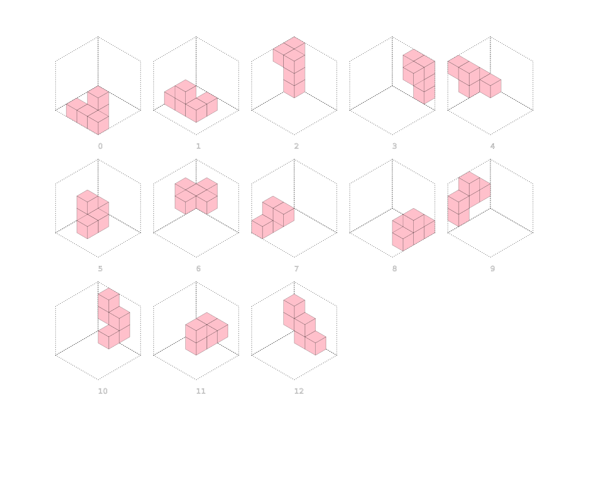

# Bedlam Cube Solver

Scripts to find solutions to the [Bedlam Cube](https://en.wikipedia.org/wiki/Bedlam_cube) and render them in SVG.

## Running

This script uses the [Bun javascript runtime](https://bun.sh/) 

`bun run Bedlam.ts`

## Original

I originally wrote a java based bedlam cube solver in around 2004. This is also [included](./java/bedlam/Bedlam.java) in this repository for comparison.

## Improvements

The script takes around 20s to run on a 2020 MacBook Pro. Things that may improve performance are:

- Switch to using [BigInt64Array](https://developer.mozilla.org/en-US/docs/Web/JavaScript/Reference/Global_Objects/BigInt64Array)
- Move away from arrays towards [structured data types](https://github.com/zrwusa/data-structure-typed)
- As it now typescript it may also be fun to have a [web UI](https://bun.sh/docs/api/http)

